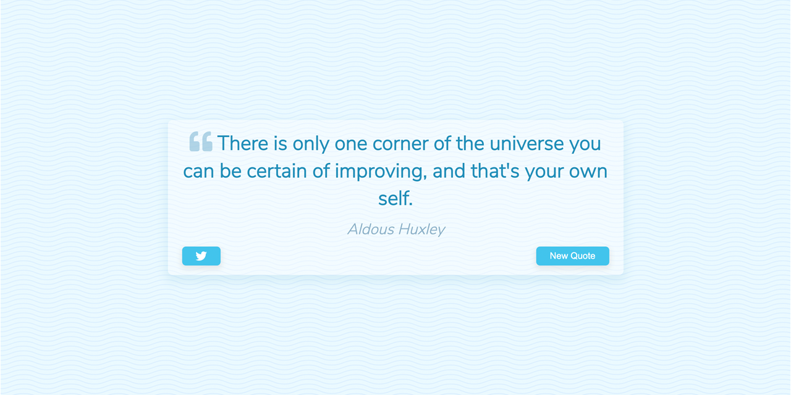

<p id="header"><p>

<table><tr>
<td> <a href=#header></a> </td>
<td> <a href="https://github.com/emjose/one-hundred/#header"></a> </td>
<td> <a href="https://github.com/emjose/color-flipper/#header"></a> </td>
</tr></table>

<br>

<p id="project-title"><p>

<a href=#table-of-contents></a>

<br>

<a href="https://emjose.github.io/quote-generator/"></a>

#

<p id="table-of-contents"><p>

<a href=#table-of-contents></a>

- [100 Days of Code](#100days)
- [Installation](#installation)
- [Live Site](#live-site)
- [Resources](#resources)
- [Let's Connect!](#lets-connect)

<br>

#

<p id="100days"><p>

<a href=#100days></a>

### Day 1: February 2, 2021

- Hello and welcome to my <a href="https://www.100daysofcode.com/">#100DaysOfCode</a> Challenge!

- I am thrilled to embark on this journey, and to kick off this challenge, I have decided to start with a mini project that I recently completed as part of the <a href="https://www.udemy.com/course/javascript-web-projects-to-build-your-portfolio-resume/">ZTM JavaScript Web Projects</a> Udemy course.

- This mini project is a quote generator that integrates with <a href="https://twitter.com/home">Twitter</a>, and it serves as a great introduction to the course material.

- The goal of this project was to get familiar with the basics of JavaScript and understand how to build a simple yet functional web application.

- **September 2022 Update:** For accessibility, lighter colors were changed to darker hues.

<br>

#

<p id="installation"><p>

<a href=#installation></a>

#### 1. Git clone and cd into the repo folder:

```console
git clone git@github.com:emjose/quote-generator.git && cd quote-generator
```

#### 2. Run the command:

```console
open index.html
```

#### 3. If you have a <a href="https://twitter.com/home">Twitter</a> account, log in to your account to tweet quotes.

<br>

#

<p id="live-site"><p>

<a href="https://emjose.github.io/quote-generator/"></a>

<a href="https://emjose.github.io/quote-generator/"></a>

• The **[Quote Generator](https://emjose.github.io/quote-generator/)** is a web application that provides users with inspirational quotes at the press of a button.

• The **[Quote Generator](https://emjose.github.io/quote-generator/)** fetches data from the [type.fit](https://type.fit/api/quotes) Inspirational Quotes API to provide a wide range of quotes for users to choose from.

• The **[Quote Generator](https://emjose.github.io/quote-generator/)** has [Twitter](https://twitter.com/home) integration, which allows users to share their favorite quotes on the platform.

• The **[Quote Generator](https://emjose.github.io/quote-generator/)** is responsive and keyboard-navigable.

• The **[Quote Generator](https://emjose.github.io/quote-generator/)** is an installable [progressive web app](https://developer.mozilla.org/en-US/docs/Web/Progressive_web_apps), providing users with a fast and reliable experience, even when offline or with limited network connectivity.

<br>

#

<p id="resources"><p>

<a href=#resources></a>

- #### [Font Awesome](https://fontawesome.com/)

- #### [Google Fonts](https://fonts.google.com/)

- #### [Inspirational Quotes API](https://quotes-react.netlify.app/)

- #### [Hero Patterns: Repeatable Background Patterns](http://www.heropatterns.com/)

- #### [JavaScript Web Projects: 20 Projects to Build Your Portfolio Udemy Course](https://www.udemy.com/course/javascript-web-projects-to-build-your-portfolio-resume/)

- #### [My blog on how I created my Github READMEs](https://emmanueljose.medium.com/readme-a-makeover-story-b9c7be37a6de?sk=7ae6623d365409d875753e4604e42ffd)

<br>

#

<p id="lets-connect"><p>

<a href=#lets-connect></a>

<p><a href="https://twitter.com/Emmanuel_Labor"></a> <a href="https://www.linkedin.com/in/emmanuelpjose/"></a> <a href="https://emmanueljose.medium.com/"></a> <a href="https://www.instagram.com/emmanuel_jose/"></a> <a href="mailto:emjose@gmail.com"></a> <a href="https://www.emmanuel-jose.com/"></a> <a href="https://github.com/emjose"></a></p>

#

<a href=#header></a>
